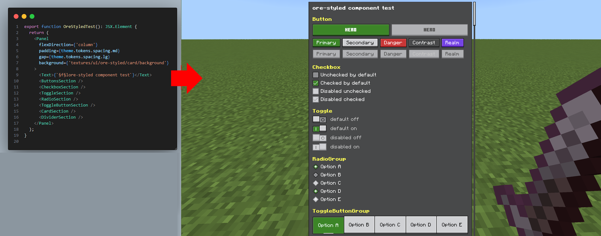

# @bedrock-core/ui

> ⚠️ Beta Status: Active development. Breaking changes may occur until 1.0.0. Pin exact versions for stability.
>
> This is not ready for production use.

Custom JSX-driven UI system for Minecraft Bedrock. Components serialize into compact strings decoded by a companion resource pack to render rich layouts beyond native `@minecraft/server-ui` limitations.

📘 Full documentation & guides: https://bedrock-core.drav.dev/

---

## 🗺 Development Roadmap

### ✅ Beta 0.1.0 - Core Foundation

- ✅ Serialization protocol with UTF-8 safety
- ✅ JSX runtime with custom component system
- ✅ Base components (`Panel`, `Text`, `Image`, `Fragment`)
- ✅ JSON UI resource pack decoder
- ✅ TypeScript library with proper exports

### ✅ Beta 0.2.0 - State & Button

- ✅ Component: `Button` with click events
- ✅ State management hooks
- ✅ Event system

### ⚠️ Beta 0.3.0

- No features, just fixes to workflows and automated releases.

### 🎨 Beta 0.4.0 - Theming & Styling (Planned)

- Component theming system
- Style variants (light/dark themes)
- ~~Text formatting (colors, bold, underline)~~ Use [Formatting Codes](https://minecraft.wiki/w/Formatting_codes)
- Automatic z-index layering
- Token based styling*

\* By using token based styling we might be able to avoid known caveats 1, thus have support for {number}(%, %c, %cm, %sm, %x, %y, px).

### 🧭 Beta 0.X.0 - Navigation (Planned)

- Multi-screen navigation system
- Screen parameters and state management
- Navigation hooks: `goBack()`, `navigate()`

### 🚧 Beta 0.X.0 - Interactive Components (Planned)

- Form components: `Input`, `Toggle`, `Slider`, `Dropdown`
- Form submission and validation

### 👀 Beta 0.X.0 - [REDACTED] (Planned)

- ?
- ?
- ?

### 🚀 Future Considerations

- Custom component registration API (create your own native JSON UI components compatible with @bedrock-core/ui)
- Compound components (tabs, menus, dialogs)
- Animation support
- Resource pack builder automation
- Reactive data binding (if feasible)
- Export feature for "non-form" JSON UI
- Support for translations params (key:string, with: string[]) in SerializableString

## 🤝 Contributing

Let's talk in Discord <https://bedrock-core.drav.dev/discord>

For technical documentation and implementation details, see:

- [UI Runtime Package](./packages/ui-runtime/README.md) - Core framework internals
- [Resource Pack](./packages/resource-pack/README.md) - Test addon and reference
- [CLI Tool](./packages/cli/README.md) - Project scaffolding

## 📖 Resources

- [Bedrock Wiki - JSON UI Introduction](https://wiki.bedrock.dev/json-ui/json-ui-intro)
- [JSON UI Documentation](https://wiki.bedrock.dev/json-ui/json-ui-documentation)

## What about ore-ui?

When it releases in `Number.MAX_SAFE_INTEGER` years, will consider if it is worth to port for ore-ui.

## Notes
Common web behaviour is one web has a single or multiple theme but all controlled by the same team/person.

Here in Minecraft we may have multiple addons each with their own UI, styling...
