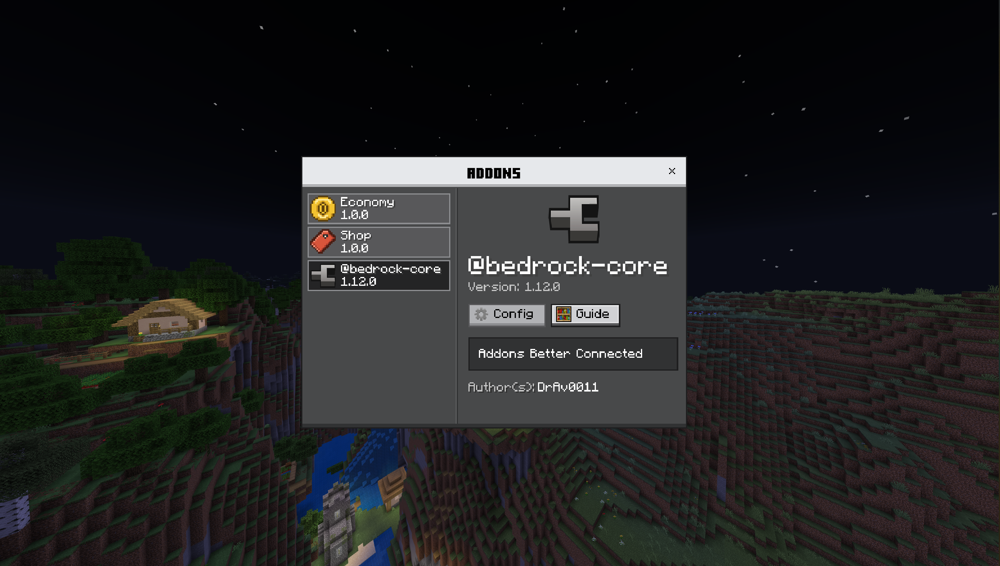

# @bedrock-core/ui

> ⚠️ Beta Status: Active development. Breaking changes may occur until 1.0.0. Pin exact versions for stability.

Custom JSX-driven UI system for Minecraft Bedrock. 
Components serialize into compact strings decoded by a companion resource pack to render rich layouts beyond native `@minecraft/server-ui` limitations.

📘 Full documentation & guides: https://bedrock-core.drav.dev/

---

## ✨ Features

### Core

- JSX runtime with a custom component system and a TypeScript library with proper exports
- Serialization protocol with UTF-8 safety, decoded by the companion JSON UI resource pack
- Hooks: `useState`, `useReducer`, `useRef`, `useEffect`, `useContext`, `useEvent`, `usePlayer`, `useExit`
- Event system with `Button` click handling
- Custom native component API — register your own native JSON UI components compatible with `@bedrock-core/ui`

### Components

- Base components: `Panel`, `Text`, `Image`, `Fragment`, `Button`
- `Background` — a screen-level background texture
- `Scroll` — up to **2** independent scroll regions per render 
- Modal-backed standalone primitives: `Input`, `Dropdown`, `Slider`

### Layout & Styling

- Flexbox layout engine — flex, margins, paddings, spacing, alignment ([@bedrock-core/flexbox](./packages/flexbox/README.md))
- Component theming system via [@bedrock-core/ore-styled](./packages/ore-styled/README.md), plus prebuilt Ore-UI styled components (`Button`, `Card`, `Toggle`, `Divider`, `Input`, `Dropdown`, `Slider`, `Checkbox`, `Radio`, `ToggleButton`)

### Navigation

- Stack-based multi-screen navigation with screen parameters and typed route state ([@bedrock-core/navigation](./packages/navigation/README.md))
- `NavigationContainer`, `createStackNavigator`, `Screen`
- Navigation hooks: `useNavigation()`, `useRoute()`

### Forms

- `<Form>` — a native `ModalFormData`-backed form with an atomic single-submit lifecycle (`onSubmit` / `onCancel`)
- Form field primitives: `Form.Toggle`, `Form.Slider`, `Form.Dropdown`, `Form.InlineSelect`, `Form.Input`, `Form.Option`
- `Form.Button` — in-flow submit / exit action buttons, positioned anywhere in the form
- Ore-Styled form fields: `Form.Toggle`, `Form.Checkbox`, `Form.Radio`, `Form.ToggleButton`, `Form.Slider`, `Form.Dropdown`, `Form.Input`, `Form.Button`

### Guides & Config

- In-game guides authored in MDX ([@bedrock-core/guides](./packages/guides/README.md)) — the `guides` regolith filter compiles `packs/data/guides/<locale>/**.mdx` into a guide manifest plus `.lang` files, and `createGuide(manifest)` renders it as a self-contained guide with its own home ⇆ page navigation, prose localized per player language
- Shared addon list + config + guide UI ([@bedrock-core/config](./packages/config/README.md)) — `ui(core)` mounts the `core:list` / `core:config` / `core:guide` commands, so one realm serves the config and guide screens for every registered addon

### 🚀 Future Considerations

- Compound components (tabs, menus, dialogs)
- Animation support
- Resource pack builder automation
- Reactive data binding (if feasible)
- Export feature for "non-form" JSON UI
- Support for translations params (key:string, with: string[]) in SerializableString
- Entity render
- Structure render

## 🤝 Contributing

Let's talk in Discord <https://bedrock-core.drav.dev/discord>

For technical documentation and implementation details, see:

- [UI Runtime Package](./packages/ui-runtime/README.md) - Core framework internals
- [Flexbox](./packages/flexbox/README.md) - Layout engine
- [Ore-Styled Components](./packages/ore-styled/README.md) - Optional prebuilt Ore-UI styled components
- [Resource Pack](./packages/resource-pack/README.md) - Test addon and reference
- [CLI Tool](./packages/cli/README.md) - Project scaffolding

## 📖 Resources

- [Bedrock Wiki - JSON UI Introduction](https://wiki.bedrock.dev/json-ui/json-ui-intro)
- [JSON UI Documentation](https://wiki.bedrock.dev/json-ui/json-ui-documentation)

## What about ore-ui/DDUI?

**ore-ui**: When it releases in `Number.MAX_SAFE_INTEGER` years, will consider if it is worth to port for ore-ui.
**DDUI**: It cannot be made compatible, DDUI does not use JSON UI so we cannot use the same methods.

## Notes
Common web behaviour is one web has a single or multiple theme but all controlled by the same team/person.

Here in Minecraft we may have multiple addons each with their own UI, styling...

## 📄 License

MIT
