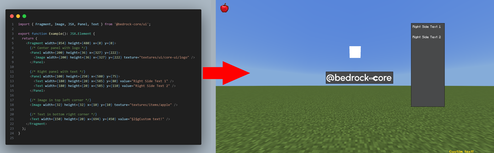

# @bedrock-core/ui


> ⚠️ Beta Status: Active development. Breaking changes may occur until 1.0.0. Pin exact versions for stability.
>
> This is not ready for production use.

Custom UI system for Minecraft Bedrock that serializes declarative component trees into compact strings. A companion JSON UI resource pack decodes these payloads to render rich UIs beyond native `@minecraft/server-ui` limitations.



---

## Why?

Working directly with JSON UI involves complex bindings, variables, and formatting challenges. This library abstracts away those complexities, letting you focus on building UIs declaratively.

## ✨ Core Idea

Native forms expose only a handful of text slots (`title_text`, `form_button_text`, `custom_text`, etc.). These strings can be read via JSON UI binding expressions. We exploit this by:

1. Building a declarative component tree (`Panel`, `Text`, `Image`, etc.)
2. Serializing compact fixed-width field segments into a single string
3. Injecting that payload into a each form component
4. Having the resource pack parse segments by byte offset to drive conditional rendering

Result: Advanced layouts, conditional logic, and style variants without custom networking.

## 🧱 Architecture Overview

| Layer | Responsibility | Key Files |
|-------|----------------|-----------|
| Component Factories | Pure functions returning `Component` objects | `src/core/components/*.ts` |
| Type Contracts | Component interfaces and serialization types | `src/types/*.ts` |
| Serialization Protocol | UTF‑8 fixed-width, semicolon-padded segments | `src/core/serializer.ts` |
| Presentation Adapter | Inject serialized payload + register form controls | `src/index.ts` |
| Resource Pack | JSON UI decoders that parse the serialized data | `assets/RP/` |

### 🔄 Component Routing System

The system uses a routing architecture to handle different component types:

**For Client-Only Components** (`Panel`, `Text`, `Image`):

1. All serialized data gets injected via `form.label()` calls
2. The `screen_container.json` factory maps `"label"` entries to `@core-ui_common.component_router`
3. The `component_router` acts as a dispatcher containing all possible component types
4. Each component JSON file (e.g., `panel.json`) uses conditional bindings: `(#type = 'panel') and #visible` to determine if it should render
5. Only the matching component type renders, others remain invisible

**For Native Form Components** (`Input`, `Toggle`, `Slider`, `Dropdown`):

- These bypass the router and use their dedicated factory control IDs
- `"toggle": "@server_form.custom_toggle"`, `"input": "@server_form.custom_input"`, etc.
- They still use the same serialization protocol for consistency

This "label-as-entry-point" system allows unlimited custom components while leveraging Minecraft's native form factory system for interactive elements.

## 📦 Installation

```bash
yarn add @bedrock-core/ui
```

**Requirements:** `@minecraft/server` ≥ 2.1.0, `@minecraft/server-ui` ≥ 2.0.0

Add the companion resource pack as a dependency of your addon and include it in your .mcaddon

```json
{
  "dependencies": [
    {
        "uuid": "761ecd37-ad1c-4a64-862a-d6cc38767426",
        "version": [
            0,
            1,
            0
        ]
    }
  ]
}
```

```txt
pack.mcaddon
├── RP/
├── BP/
└── core-ui.mcpack
```

## 🚀 Quick Start

```ts
import { Player } from '@minecraft/server';
import { present, Panel, Text } from '@bedrock-core/ui';

const ui = Panel({
    width: 300,
    height: 200,
    x: 50,
    y: 50,
    children: [
        Text({ 
            width: 250,
            height: 30,
            x: 25,
            y: 25,
            value: 'Player Settings' 
        })
    ]
});

await present(player, ui);
```

## 🧩 Component Pattern

Each factory returns a plain object describing JSON UI properties plus a `serialize` method:

```ts
export function Panel({ children, ...rest }: PanelProps): Component {
    return {
        serialize: (form: CoreUIFormData): void => {
            const serializable: SerializableComponent = {
                type: serializeString('panel'),
                ...rest,
            };
            
            const [result, bytes] = serialize(serializable);
            form.label(result);
            
            children.forEach(child => child.serialize(form));
        },
    };
}
```

Conventions:

- All components require `width`, `height`, `x`, `y` as we are currently using absolute positioning (no defaults)
- Factory prop names are camelCase; emitted JSON UI keys follow snake_case
- Use `serializeString()` for all string values - native strings throw errors
- **All "optional" props must have defined defaults in the serialized component** - no undefined/null values allowed
- No side-effects in factory body; all form API calls occur in `serialize`

## 🔐 Serialization Protocol

Defined in `core/serializer.ts`.

Payload always starts with a 9-character header: `bcui` + `vXXXX` (e.g., `bcuiv0001`). Decoders must skip these first 9 chars before field slicing.

Each field is composed of three conceptual parts concatenated in this order:

1. Type prefix (2 bytes)
2. Value (padded with semicolons `;` until defined byte length)
3. Unique 1‑byte field marker (disambiguates otherwise identical full regions during JSON UI subtraction)

### Field Widths (bytes)

| Type     | Prefix | Prefix Width | Type Width | Marker Width | Full Width | Notes |
|----------|--------|--------------|------------|--------------|------------|-------|
| String   | `s:`   | 2            | 32         | 1            | 35         | Use `serializeString(value, maxBytes?)`. Default maxBytes = 32 |
| Number   | `n:`   | 2            | 24         | 1            | 27         | All numbers use same format (no int/float distinction) Treat in JSON UI accordingly |
| Boolean  | `b:`   | 2            | 5          | 1            | 8          | Serialized as `'true'` or `'false'` |
| Reserved | `r:`   | 0            | variable   | 0            | variable   | No prefix/marker for easier JSON UI skipping |

### Markers

Markers come from a stable ordered alphabet (`0-9A-Za-z`) plus `-` and `_`.
This limits the max number of props a component might have to 64. There is no single JSON component which
Index position = field order. If you append new fields, they receive the next marker; never reorder existing markers (backward decode offsets rely on stable sequence).
This is to avoid the 2nd known caveat (below).

### Encoding Example

```ts
import { serialize, serializeString } from '@bedrock-core/ui';
const [encoded, bytes] = serialize({
    type: serializeString('example'), // string → 35
    message: serializeString('hello'), // string → 35
    count: 123,                        // number → 27
    ratio: 45.67,                      // number → 27
    ok: true,                          // bool → 8
});
// Per-field widths = 35 + 35 + 27 + 27 + 8 = 132 bytes (plus 9-byte header)
// All strings MUST use serializeString() - native strings throw errors
```

### Field Binding Template Pattern (Decoding)

Decoding inside the resource pack uses a progressive "slice → subtract" strategy. Each field follows a 3‑step lifecycle:
components
`extract_raw → update_remainder → extract_value`

Generic template (JSON UI binding entries) — copy & replace placeholders:

```jsonc
{
    "binding_type": "view", // full_width
    "source_property_name": "('%.{FULL_WIDTH}s' * #rem_after_{PREV})",
    "target_property_name": "#raw_{FIELD_NAME}"
},
{
    "binding_type": "view",
    "source_property_name": "(#rem_after_{PREV} - #raw_{FIELD_NAME})",
    "target_property_name": "#rem_after_{FIELD_NAME}"
},
{
    "binding_type": "view", // (full_width - marker_width) - prefix_width - padding_char (;)
    "source_property_name": "(('%.{FM_WIDTH}s' * #raw_{FIELD_NAME}) - ('%.2s' * #raw_{FIELD_NAME}) - ';')",
    "target_property_name": "#{FIELD_NAME}"
},
```

**For reserved blocks (skip pattern):**

Placeholder reference:

- `{FIELD_NAME}` unique identifier (e.g. `type`, `visible`)
- `{PREV}` previous remainder token (first field uses `header`, others use previous field name)
- `{FULL_WIDTH}` from table full_width column
- `{FM_WIDTH}` table (full_width - marker_width)
- `{RESERVED_WIDTH}` reserved block width in bytes (e.g., 277)
- `{RESERVED_NAME}` unique identifier

### Base Control Properties Deserialization Order

All components inherit these base control properties, which are deserialized in this exact order after the 9-byte protocol header (`bcuiv0001`):

```text
Field 0: type (string, 35 bytes)                  - component type identifier
Field 1: width (number, 27 bytes)                 - element width
Field 2: height (number, 27 bytes)                - element height
Field 3: x (number, 27 bytes)                     - horizontal position
Field 4: y (number, 27 bytes)                     - vertical position
Field 5: visible (bool, 8 bytes)                  - visibility state (default: true)
Field 6: enabled (bool, 8 bytes)                  - interaction enabled (default: true)
Field 7: layer (number, 27 bytes)                 - z-index layering (default: 0)
Field 8: alpha (number, 27 bytes)                 - transparency (default: 1.0)
Field 9: inheritMaxSiblingWidth (bool, 8 bytes)   - width inheritance (default: false)
Field 10: inheritMaxSiblingHeight (bool, 8 bytes) - height inheritance (default: false)
Field 11: __reserved (274 bytes)                  - reserved for future expansion

Total: 512 bytes per component (fixed allocation)
```

**Component-specific properties** are appended after the reserved block.

### Decoding Rules & Tips

- Always slice FULL field (value + prefix + marker) first, then subtract to create the remainder.
- Strip padding only after isolating the core full segment (second slice) so you don't accidentally remove semicolons in later fields.
- Never assume a marker character appears only once globally — its uniqueness is only relative to its position; treat the raw slice atomically.
- Protocol extension rule: append new fields (new markers) at the end; never reorder or shrink earlier core lengths.
- Reserved blocks are skipped entirely in deserialization—they create "gaps" in the payload that the JSON UI decoder jumps over.

UTF‑8 Safety: `utf8Truncate` ensures multi‑byte characters are not cut mid sequence when enforcing byte budgets.

### UTF‑8 Safety

`utf8Truncate` prevents cutting surrogate pairs; always rely on helper functions.

## ⚠️ Known Caveats

- JSON UI string ops with numbers can behave unpredictably; prefix markers before numeric-derived substrings client-side.
- Subtraction operator (`-`) removes all occurrences; use distinct prefixes to avoid collisions.

## 🗺 Development Roadmap

### ✅ Beta 0.1.0 - Core Foundation

- ✓ Serialization protocol with UTF-8 safety
- ✓ Base component system (`Panel`, `Text`, `Image`)
- ✓ JSON UI resource pack decoder
- ✓ TypeScript library with proper exports

### 📋 Beta 0.2.0 - Navigation & State (?)

- Components: `Button`
- Event handling system for button clicks
- Multi-screen navigation system
- Screen parameters and state management (?)
- Navigation hooks: `goBack()`, `navigate()`, `exit()`

### 🚧 Beta 0.3.0 - Interactive Components

- Form components: `Button`, `Input`, `Toggle`, `Slider`, `Dropdown`
- Form submission and validation

### 🎨 Beta 0.4.0 - Theming & Styling

- Component theming system
- Style variants (light/dark themes)
- Text formatting (colors, bold, underline)
- Automatic z-index layering

### 🚀 Future Considerations

- Custom component registration
- Compound components (tabs, menus, dialogs)
- Animation support
- Resource pack builder automation
- TSX preprocessor support
- Reactive data binding (if feasible)
- Export feature for "non-form" JSON UI

## 🤝 Contributing

Let's talk in Discord <https://bedrocktweaks.net/discord>

## 🔗 Reference Documentation

- [Bedrock Wiki - JSON UI Introduction](https://wiki.bedrock.dev/json-ui/json-ui-intro)
- [JSON UI String Operations](https://wiki.bedrock.dev/json-ui/json-ui-intro#using-operators)
- [String Formatting & Number Conversion](https://wiki.bedrock.dev/json-ui/string-to-number)
- [JSON UI Documentation](https://wiki.bedrock.dev/json-ui/json-ui-documentation)

## What about ore-ui?

When it releases in `Number.MAX_SAFE_INTEGER` years, will deprecate this completely (as JSON-UI will not exist) and look if it is worth to remake it for ore-ui.

## Notes

Support for translations (key:string, with: string[]) in SerializableString
